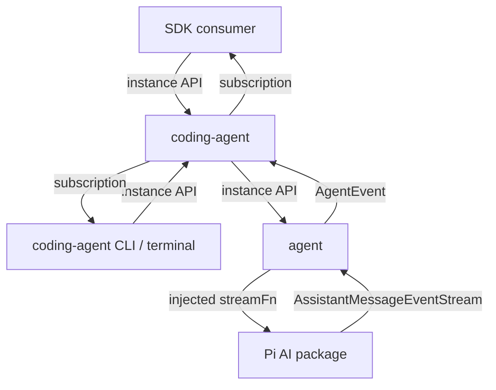

# Loop

Loop is a local-first agent harness. Its CLI and SDK share a persistent coding session, a generic agent loop, and Pi AI for model calls.

## Start locally

Requires [Bun](https://bun.sh/) 1.1 or newer. Install dependencies with `bun install` and configure a local `.env`:

```sh
LOOP_AI_PROVIDER=openai
LOOP_MODEL=gpt-5.5
LOOP_AI_API_KEY=your-api-key
```

Start the CLI:

```sh
bun run chat                 # alias for coding-agent interactive mode
bun run coding-agent         # coding CLI: /model /new /resume /abort
bun run coding-agent -p "Read package.json"
```

`LOOP_AI_BASE_URL` optionally overrides the selected model's compatible endpoint. New sessions default to OpenAI GPT-5.5. With a custom URL, the OpenAI provider uses Chat Completions for gateways such as Agent Maestro; without one it uses native Responses. Explicit settings and saved sessions retain their model selection. Use `LOOP_DATA_DIR` for storage (default `~/.loop`). Credentials are supplied to the CLI or SDK through model configuration.

## Session interaction

Terminal chat supports:

```text
/abort
/model [provider/model]
/new
/resume [path]
/flush
/quit
```

Run `bun run coding-agent --session /path/to/session.jsonl` or `bun run coding-agent --continue` to restore a conversation. Concurrent prompts reject. Each prompt creates a new Agent with the saved history. Cross-process editing of one session is not coordinated.

One-shot runs use --print/-p. Sessions enable read, bash, edit and write by default. See [coding-agent documentation](src/coding-agent/README.md) for model configuration, custom URLs, persistence and recovery. Old run/chat/doctor subcommands and --json/--file flags are removed; bun run chat remains an alias for interactive mode.

```sh
bun run coding-agent --help
```

## Source boundaries

```text
src/
  coding-agent/
    core/
      sdk.ts                       Session creation
      agent-session.ts             Session API and persistence coordination
      agent-session-runtime.ts     Current session and idle replacement
      session-manager.ts           Stored sessions
      model-runtime.ts             Pi AI stream function wiring
      settings-manager.ts          Default model configuration
      resource-loader.ts           Project instruction discovery
      tools/                       read, bash, edit and write
      types/                       Application contracts
    cli.ts / main.ts               Coding CLI entry points
    cli/                           CLI argument parsing
    modes/                         Print and interactive modes
  agent/
    types.ts                       Tool, event, configuration and stream contracts
    agent-loop.ts                  Model turns, sequential tools and history writes
    agent.ts                       In-memory history, subscriptions and cancellation
    index.ts                       Public exports
```

All folders belong to one Bun project, with one package manifest and dependency installation. Feature tests live beside their implementation.

Commands flow downward: CLI/SDK -> `coding-agent` -> `agent` -> Pi AI. Coding-agent uses the public Agent entry. The terminal CLI lives inside coding-agent and calls its core. Reverse imports and cross-layer internal imports are forbidden. The SDK core must not depend on CLI entry points or terminal modes.

Events and streams carry results upward through subscriptions defined by the lower layer. They do not introduce imports of upper-layer implementations. Coding-agent configures models and injects the Pi AI stream function; the agent loop initiates model calls.

These boundaries are checked by `bun run check:architecture`, which also runs as part of `bun run check` and `bun test`.



The layout follows Pi's core entry points while keeping implementation and type files small. Terminal entry points and modes live inside coding-agent.

The coding-agent public API exposes createAgentSession, AgentSession, AgentSessionRuntime and SessionManager. Runtime manages one current Session and idle new/switch operations. SessionManager atomically commits complete history snapshots after each prompt. Session methods include prompt, abort, waitForIdle and subscribe. Persistence remains in coding-agent and is not part of agent.

The basic loop is adapted from Pi. Agent requires an explicit streamFn and accepts model, systemPrompt, tools, streamOptions and optional maxTurns. prompt(text) returns the final AssistantMessage; messages returns an isolated snapshot of completed history, and isRunning reports active execution. subscribe returns an unsubscribe function. abort signals the active request or tool; await the prompt promise to observe completion. Tools must cooperate with the cancellation signal.

runAgentLoop(text, history, options, onEvent?, signal?) is independently callable and is the sole writer of the supplied history array. It consumes one Pi AI stream and reads that same stream's result() for each model request. Completed assistant messages are appended once. Tools execute sequentially after Pi AI argument validation, and their results feed the next model turn until the model finishes. execute functions stay local and are excluded from tool declarations.

Events are message_start, message_update, message_end, tool_execution_start and tool_execution_end. message_update.assistantMessageEvent preserves the native AI event fields in an event-time snapshot because Pi partial messages are mutable. Streaming drafts never enter Agent.messages; coding-agent exposes a separate draft through Session state. Agent listeners are awaited; listener failures reject its run. Session listeners are isolated instead, and their failures are recorded in Session state.

Missing tools, invalid arguments and tool failures become isError tool results with matching toolCallId and toolName. Model error, aborted, length, deferred and unfinished responses reject prompt; cancellation and exhausted maxTurns also reject. No new tool or model request starts after cancellation. Unexecuted tool calls receive error results before another prompt can run. Pi AI filters error/aborted assistant messages on replay. Unexpected request failures leave no fabricated assistant message. Finally blocks release the agent for the next prompt. There are no queues, steering, follow-up, agent retries, compaction, parallel tools or tool hooks.

See [src/agent/agent.sample.ts](src/agent/agent.sample.ts) for a minimal consumer example: configure the Maestro model, create an Agent, subscribe to text deltas and call prompt(). Text is written to the terminal as it arrives; the final answer is not printed again. Start Maestro at http://127.0.0.1:23333/api/openai/v1 and set AGENT_MAESTRO_API_KEY if authentication is enabled. Run `bun src/agent/agent.sample.ts` to call gpt-6-astra through Pi AI's OpenAI completions protocol. This sample makes a real model request.

See [THIRD_PARTY_NOTICES.md](THIRD_PARTY_NOTICES.md) for Pi attribution and its MIT license.

The installed dependency remains Pi AI 0.85.1. It uses Context.systemPrompt and Context.tools, and exports transformMessages through api/transform-messages for history normalization; the newer TranscriptContext and normalizeContext APIs are unavailable in this version. Model/provider/authentication setup stays in the host. No Provider implementation or stream parser is copied.

## Validation

```sh
bun run typecheck
bun test
bun run check
```

Tests use inputs defined in each feature's test file. Pi AI integration is checked against a local HTTP streaming fixture without production credentials or paid model calls.

See [CONTRIBUTING.md](CONTRIBUTING.md) and [SECURITY.md](SECURITY.md).
