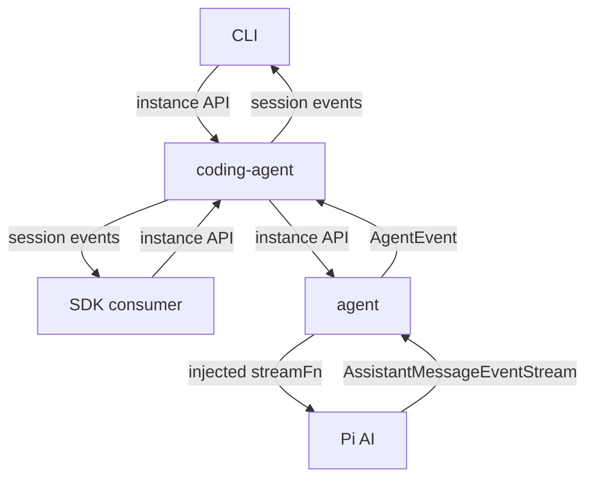

# Loop

Loop is a local-first agent harness. Its CLI and SDK share a persistent coding session, an in-memory agent loop, and Pi AI for model calls.

## Start locally

Requires [Bun](https://bun.sh/) 1.1 or newer. Install dependencies with `bun install` and configure a local `.env`:

```sh
LOOP_AI_PROVIDER=openai
LOOP_MODEL=gpt-5.5
LOOP_AI_API_KEY=your-api-key
```

Choose interactive CLI, one-shot Print, or the SDK sample:

```bash
bun run coding-agent
bun run coding-agent --print "Read package.json"
bun src/coding-agent/sdk.sample.ts "Hello, what time is it now?"
```

For compatible gateways, configure `LOOP_AI_BASE_URL` and credentials as described in [Models](src/coding-agent/docs/models.md). Without a custom URL, OpenAI uses native Responses. With a custom URL, the OpenAI provider uses Chat Completions.

## Documentation

| Module | Start here | Feature guides |
| --- | --- | --- |
| Agent | [Overview](src/agent/README.md) | [API](src/agent/docs/agent.md), [loop](src/agent/docs/agent-loop.md), [events](src/agent/docs/events.md), [tools](src/agent/docs/tools.md), [cancellation](src/agent/docs/cancellation.md) |
| Coding-agent | [Overview](src/coding-agent/README.md) | [SDK](src/coding-agent/docs/sdk.md), [CLI](src/coding-agent/docs/cli.md), [models](src/coding-agent/docs/models.md), [sessions](src/coding-agent/docs/sessions.md) |

Each module's README indexes its feature pages. Documentation describes the current Loop implementation; Pi features not implemented here are not part of the API.

## Source boundaries

```text
src/
  agent/
    agent.ts        In-memory history, subscriptions, and cancellation
    agent-loop.ts   Model requests and sequential tools
    types.ts        Agent contracts using Pi AI types
    index.ts        Public exports
    docs/           One Markdown page per feature
  coding-agent/
    core/           SDK, sessions, models, resources, and coding tools
    cli.ts          Terminal entry point
    main.ts         CLI configuration and lifecycle
    cli/            Argument parsing
    modes/          Interactive and Print consumers
    index.ts        Public exports
    docs/           One Markdown page per feature
```

One Bun project contains both layers. Commands flow downward through public entries; events flow upward through subscriptions. Agent does not import coding-agent. The coding-agent core and SDK do not import terminal modes. `bun run check:architecture` enforces these boundaries.



Pi AI owns providers, authentication integration, and response parsing. Agent owns the tool/model loop. Coding-agent owns persistence and application services. There is no separate workspace package installation.

## Validation

```bash
bun test
bun run typecheck
bun run check
```

Tests use local synthetic model endpoints without production credentials or paid requests. The CLI PTY test requires Python 3. Runnable samples use real configured models.

See [Contributing](CONTRIBUTING.md), [Security](SECURITY.md), and [third-party notices](THIRD_PARTY_NOTICES.md).
