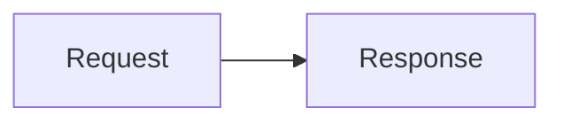

# Message Rendering

The timeline displays completed history and the current streaming draft. Drafts replace content at a message position; each text delta does not become a separate history entry.

User messages use compact spacing before assistant text, tool calls or the Looping indicator. The timestamp and copy controls keep their reserved space, so revealing them does not shift the conversation.

## Supported Content

| Content | Behavior |
| --- | --- |
| User messages | Text and attachments, with a timestamp and copy icon revealed below on hover |
| Assistant text | Markdown, syntax highlighting, tables, KaTeX math, and Mermaid diagrams |
| Thinking | Retained in native messages and events, hidden in the conversation |
| Tool calls | Collapsed batch showing the latest call while active, then a completion summary; expand the batch and a row to inspect parameters and results |
| Failed messages | Display errorMessage after streaming ends; errors remain visible when reopening history |

Tool calls and results merge by toolCallId instead of creating duplicate cards. A standalone result without a corresponding assistant call can still be displayed. Tools show actual execution state and final output, with no invented progress or interactive terminal.

## Prompt Duration

A muted Working for row with a thin divider appears below the latest user message while generation is active, updating once per second. At generation completion, it becomes Worked for above the final response, after preceding plans and tool batches. Both interface languages use these English labels. Durations below 60 seconds display as Ns; at 60 seconds and above, they display minutes and remaining seconds, such as 2m 5s or 6m 5s. Seconds are rounded down and never negative. The display is a standalone row with no disclosure or reasoning section, and it does not move existing assistant text.

Server prompt_timing events and state.promptTimings provide acceptance/finish timestamps. Completed durations stay fixed across reconnects, refresh, history reopening and save retries. Failure and cancellation also stop the clock; when no final text exists, the completed duration appears after the turn's available content. Earlier history without timing metadata displays no duration. Saving and background title generation do not contribute to elapsed generation time.

## Tool Groups and Action Updates

Each user turn displays its assistant messages in history order: a model-authored phase update, related tool calls, subsequent updates and batches, then the final reply. Visible text and collapsed tool batches are laid out in the conversation. There is no reasoning disclosure, nested execution-group heading, elapsed-work header or height-limited internal scroll area. Reopened history keeps updates and completed batch summaries visible; tool batches and individual parameters/results start collapsed. Thinking is omitted from the conversation without changing native messages, events, model replay, SDK history or storage. Model effort settings are independent of this presentation.

The default prompt requires a nonempty plan before every tool batch, as ordinary assistant text in the user's language before the first call in the same response. One or two sentences explain the whole batch's action and purpose; each subsequent tool-calling response gets its own plan, including continued work, retries and verification after earlier results. These are observable plans and findings, not private reasoning or unverified success claims. This is model guidance rather than runtime enforcement: tool-only responses remain visible with local action summaries, and earlier history is not rewritten. Restart the Web process to load changed default instructions for already-loaded sessions. See [default prompt instructions](../../../../coding-agent/src/docs/context-files.md).

Phase updates are ordinary assistant text arriving through native `text_delta` events. They appear immediately in their original message position and are never moved when later tool calls or assistant messages arrive. Final text uses the same rendering path and also appears before session settlement. No tool-parameter description, display marker, extra model request, text heuristic or buffering protocol is used. Version-1 `textSignature` commentary/final-answer metadata remains in messages; rendering order does not depend on it. Commentary-only and tool-call messages do not get a final-response footer. The last reply gets its timestamp and copy controls after generation ends; copying excludes thinking and tool arguments. Existing marker text remains literal content subject to normal Markdown rendering.

Consecutive tool calls within one assistant message form a batch keyed by its first call ID. Text and message boundaries separate batches; hidden thinking does not. A batch starts collapsed with one category icon and a single-line label. Hovering or keyboard-focusing its summary changes the text to the primary color (black in Light mode) and reveals a right-pointing chevron next to the label. Opening the batch keeps the text highlighted and the chevron visible, pointing down; closing restores the right-pointing chevron. Touch devices keep the chevron visible. During call generation, the label follows the newest call and its streamed arguments. During sequential execution, it shows the currently running call, or the latest queued call when none is running. A soft, 80px-wide light band sweeps from left to right across stationary gray text while the batch is being generated or has waiting/running calls. Each two-second cycle includes a brief pause after the band exits; the category icon remains still. Light and Dark themes retain a bright sweep. Hover, keyboard focus and an open batch use solid primary text instead of the sweep. Reduced-motion and forced-colors preferences also disable the sweep.

Once generation has moved past the batch and every call has succeeded or failed, the label switches immediately to a frontend-generated completion summary, such as **Edited files, Read files and Ran commands** or **Read 3 files**. Mixed summaries combine successful action types in first-appearance order; single-action summaries include counts. Failed calls are counted explicitly and never described as successful. Unknown successful tools retain their names. The sweep stops when the batch finishes, even while the model is producing its final reply. These summaries require no model request, are neither saved nor copied as assistant text, and do not replace model-authored plans or replies. Click or keyboard-activate the batch disclosure to see all calls; it stays collapsed unless the reader opens it.

Assistant messages stay keyed by their history positions and tool rows by call IDs. Consecutive assistant messages use a single 6px outer gap; tool groups at message edges do not add another margin. These message boundaries do not represent missing text or thinking placeholders. Streamed arguments, results, completion and reconnect snapshots preserve the same mounted text nodes and open tool details. Paired tool results update their existing call row; standalone results remain inspectable. Failed or cancelled responses retain any partial text and reported errors. Errors with no text remain visible, thinking-only drafts produce no empty message, and tool-only turns do not invent a final reply. The Looping indicator covers model waiting, text generation and tool execution until the prompt ends.

Each tool row starts with a muted category icon: an open book for read, a file with a plus for write, a pencil for edit, a terminal for bash, and a generic grid for other tools. Categories follow the tool name rather than interpreting shell commands; the separate status icon stays on the right. Icons are decorative because the adjacent text names the action. Inside an expanded batch, each tool appears as an action and its actual argument, such as **Read src/app.ts** or **Ran pnpm exec vitest run**, followed by its status icon. Read/write/edit rows use the path parameter. Bash rows show the actual command and never read a per-call description for the label. Group action summaries come entirely from the frontend. Action labels follow the interface language and execution state, including **Run**, **Running** and **Ran** for Bash; waiting or failed calls never use a success verb. Missing or incomplete arguments use a generic file/command label until a string value arrives; unknown tools retain their name. Each tool row uses the full available width. Hovering or keyboard-focusing its header changes the label to the primary text color (black in Light mode) and reveals a right-pointing chevron at the far right. Clicking or keyboard-activating the header opens the existing parameters/result panels; the chevron points down and stays visible while open. Touch devices keep the chevron visible, and reduced-motion preferences disable its transition. Long paths and commands stay on one line with an ellipsis and a full-text hover title. These labels derive from existing streamed arguments and history without another model call. Tool batches use compact spacing between action updates and tool rows, with 5px vertical row padding and 6px group margins. They retain a shared left vertical line inset by 5px at both ends and indented rows, with tighter indentation on narrow screens; action updates stay outside that indentation. Tool rows are available inside the disclosure as soon as tool-call generation arrives, before execution finishes. The icon to the right of the name spins from tool_execution_start until tool_execution_end, becomes a green check on success or a red cross on failure; queued calls retain a neutral waiting icon. Tool execution starts are synchronously committed to React, so even start/end events delivered in the same browser task initialize each row's running indication. For a live tool that succeeds in under 200ms, its icon completes a minimum 200ms running indication before showing the check, preventing start/end events received in one paint interval from hiding all activity. This local visual transition does not delay results, subsequent tools, final answers, stored status or the accessible status label. Errors and cancellation update immediately; completed history never replays the spinner. Hidden pages and reduced-motion preferences skip the hold, and each tool has its own timer that is cleared on unmount. Cancellation retains the existing error results for skipped or cancelled calls rather than inventing successful completion. Expand a tool row to inspect its parameters and result. Tool results have no copy button. Parameters and results use equal-height adjacent panels on desktop, capped at 220px with independent scrolling, and stack on narrow screens.

Tool batches use the first call ID for stable identity and each tool row uses its own call ID. Streaming arguments, added calls, completion and reconnect snapshots preserve the open batch disclosure and individual tool details while the timeline stays mounted. Reopening a session shows completed text and batch summaries, with both batches and individual tool details collapsed again. Different user requests and sessions never share a turn.

Parameter and result panels mount only when a tool row and its containing batch are both expanded. Collapsing either disclosure removes the detail DOM and avoids formatting hidden arguments or joining hidden output. Lightweight row headers remain mounted to track execution status and preserve individual expansion choices; reopening a batch restores previously expanded rows with current arguments and results. Standalone tool rows follow the same on-demand detail behavior. Original output remains in session state and history without truncation, so this reduces rendering allocations rather than the size of the retained session data.

## Markdown and Copying

marked and KaTeX convert Markdown, then DOMPurify sanitizes it. Interactive elements such as form controls are removed from model content. Links retain only HTTP(S) targets and use noopener/noreferrer when opening a new window. highlight.js highlights code blocks with recognized languages.

User messages and completed assistant replies reveal a bottom row with the message time and an icon-only copy button on hover or keyboard focus. The row stays visible on touch devices and reserves its space to avoid shifting the conversation when revealed. Times use the interface language and local time zone; hovering over a time shows the full date and time. Attachment-only messages show the time without an empty copy action.

Code-block buttons copy the original code text. The complete assistant message's copy button includes text only, excluding thinking and tool arguments. Message copy buttons use localized **Copy message** and **Copy response** tooltips and accessible labels for user messages and assistant replies, respectively. They show a check on success or an error icon on failure, with localized tooltips and screen-reader feedback. The UI is not a full image, audio, or attachment viewer.

### Mermaid Diagrams

Assistant text renders fenced `mermaid` code blocks as diagrams, including restored history and intermediate assistant updates. For example:

Mermaid initializes on demand in the browser from the bundled dependency; no model call or remote rendering service is used. Diagrams follow Light, Dark and System appearance, including live system-theme changes. Each preview is a borderless, keyboard-focusable scroll region with no view toggle or source disclosure. Hover over the diagram or focus within it to reveal a top-right copy icon; touch devices keep it visible. The icon button has a transparent background, including on hover, so it blends into the surrounding preview in every theme. Its localized **Copy Mermaid source** tooltip and accessible label identify the action. Clicking it copies only that block's original Mermaid text, preserving whitespace without Markdown fences or generated SVG. After the clipboard confirms success, that button changes to a visible checkmark with a localized **Copied** label for three seconds, then restores the copy icon. Repeated successful copies restart the timer, and each diagram has independent feedback. Failed copies retain the copy icon with localized failure feedback instead of a success check. The button announces the result to screen readers, and the preview stays visible. Replacing the diagram or unmounting the message clears its timer and ignores late clipboard results. **Copy response** still copies the original Markdown, not generated SVG. Ordinary code blocks, user text and tool output keep their existing behavior.

During streaming, rendering waits for a 200ms pause in text updates. Source stays readable while loading or rendering, and unchanged successful diagrams are reused within the mounted message. Completing a response triggers rendering without that delay. Stale results are ignored after text changes or unmount; queued obsolete work is skipped. An already running Mermaid render cannot be interrupted, but its temporary DOM is removed when it settles. Syntax, size, layout or loading failures preserve the source and do not prevent other blocks from rendering. Completed responses show a localized fallback notice; partial streaming diagrams do not show error notices.

Rendering uses strict security, disables HTML labels and automatic document scanning, protects security/theme settings from diagram configuration, sanitizes generated SVG separately from Markdown, and does not bind diagram callbacks or retain clickable diagram links. Limits are 50,000 source characters and Mermaid's 500-edge limit; oversized or unsupported diagrams remain source. Rich HTML labels, custom icon packs, external diagram/layout plugins, zoom and export controls are not supported. Stored messages and backend/SDK contracts are unchanged.

## Scrolling and Lifecycle

Phase text, tool batch disclosures and final replies use the conversation viewport, with no separate reasoning scroll area. Expanding a batch reveals its tool rows; expanding a row reveals its existing bounded parameter/result panels.

Sending a message scrolls that user message to the top of the conversation viewport. Short turns reserve space below the content so the message can reach the top; replies fill that space as they grow. Streaming text, tool activity, completion and reconnect updates do not automatically scroll the conversation. Readers can scroll freely, and each new user message aligns at the top again. A compact circular button appears when content extends below the viewport, with **Jump to latest** as its localized tooltip and accessible label. During connected generation, it shows three neutral dots waving upward in sequence on a 1.2-second cycle. Hovering or keyboard-focusing the button reveals the down arrow; leaving it restores the running animation without restarting its cycle. Reduced-motion and forced-colors preferences retain three static dots. Completion, cancellation, errors, disconnection and non-prompt operations restore the down arrow. Clicking either version scrolls to the latest content once, without enabling automatic following. Opening completed history starts at the latest content; opening a running conversation starts at its latest user message.

Complete snapshots come from the server. The browser maintains display state only and reloads history after refresh, rather than restoring a separate chat history from browser storage. See [streaming state](events.md).

## Source and Tests

- [MessageTimeline](../components/chat/MessageTimeline.tsx) / [tests](../components/chat/MessageTimeline.test.tsx).
- [AssistantMessage](../components/chat/AssistantMessage.tsx) / [tests](../components/chat/AssistantMessage.test.tsx).
- [PromptDuration](../components/chat/PromptDuration.tsx) / [tests](../components/chat/PromptDuration.test.tsx).
- [AssistantTurn](../components/chat/AssistantTurn.tsx) / [streaming and recovery tests](../components/chat/AssistantTurn.test.tsx).
- [Turn projection](../components/chat/timeline-turns.ts) / [tests](../components/chat/timeline-turns.test.ts).
- [ToolCard](../components/chat/ToolCard.tsx) / [tests](../components/chat/ToolCard.test.tsx).
- [ToolGroup](../components/chat/ToolGroup.tsx) / [tests](../components/chat/ToolGroup.test.tsx).
- [Tool completion summaries](../components/chat/tool-action-summary.ts) / [tests](../components/chat/tool-action-summary.test.ts).
- [Tool labels](../components/chat/tool-label.ts) / [tests](../components/chat/tool-label.test.ts).
- [Content grouping](../components/chat/assistant-content.ts) / [tests](../components/chat/assistant-content.test.ts).
- [Markdown utilities](../lib/markdown.ts) / [security and formatting tests](../lib/markdown.test.ts).
- [MarkdownText](../components/chat/MarkdownText.tsx) / [rendering and copy tests](../components/chat/MarkdownText.test.tsx).
- [Mermaid renderer](../lib/mermaid.ts) / [SVG security and rendering tests](../lib/mermaid.test.ts).
- [Mermaid copy feedback](../lib/mermaid-copy.ts) / [timer and clipboard tests](../lib/mermaid-copy.test.ts).
- [useMermaid](../hooks/useMermaid.ts) / [streaming, theme and lifecycle tests](../hooks/useMermaid.test.tsx).
- [useAutoScroll](../hooks/useAutoScroll.ts) / [tests](../hooks/useAutoScroll.test.tsx).
- [Tool projection](../../shared/tool-projection.ts) / [tests](../../shared/tool-projection.test.ts).
