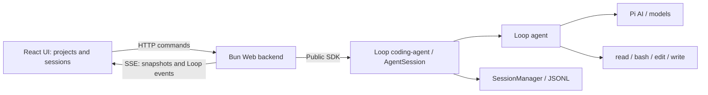

# Loop Web UI Technical Design

Status: migrated to a Bun workspace. Web frontend and backend share `src/web-ui/package.json`; dependencies and `bun.lock` are managed at the root. The development entry is `bun run-dev`. See the [Web README](../README.md) for startup, feature navigation, and validation commands.

Usage and actual contracts for implemented features are documented separately in the [frontend](../frontend/README.md) and [backend](../backend/README.md) feature indexes. Their docs directories contain one page per feature; this document retains the overall design and distribution plan.

## 1. Design Decisions

The goal is to use Loop coding-agent in the browser through a project-based chat interface.

| Area | Decision |
| --- | --- |
| Agent | Use this project's public `src/coding-agent` SDK |
| Directories | Keep frontend, backend, and shared protocol under `Loop/src/web-ui/`, with design documents in its `docs/` directory |
| Runtime | Keep Loop's unified Bun project; Bun serves HTTP, SSE, and frontend pages |
| Startup target | Eventually use `npx loop web` to start a local service and open the browser; npm distribution requires later integration |
| Project management | Add, rename, and remove projects in the frontend; the Projects tree groups sessions by project |
| Directory selection | Prefer the system picker on local macOS; otherwise use browser directory navigation, with typed paths supported |
| Language | English and Chinese, defaulting to English and retaining the user's choice |
| Interface | Provide a project sidebar, session layout, composer, and streaming message rendering |
| Feature scope | Expose only existing Loop capabilities; omit unsupported controls and placeholders |
| Model configuration | Configure a custom provider, Base URL, model, and authentication in sidebar settings; persist through the backend without requiring environment edits |
| Change boundary | Web implementation stays in `src/web-ui/`; workspace integration updates root manifests, lockfile, checks, and architecture tests while preserving core responsibilities |

All Web frontend, backend, and shared protocol code is maintained within this repository under `src/web-ui/`.

## 2. Architecture and Directories

The browser handles input and rendering; the backend owns AgentSession instances. Loop handles model calls, tools, and session storage. The browser sends HTTP commands and receives activity over SSE, a persistent server-to-client event connection.



Suggested structure follows. Create files for actual responsibilities rather than prebuilding empty modules:

```text
Loop/
├── package.json                   # Workspace, core dependencies, shared scripts
├── bun.lock                       # Shared lockfile
└── src/
    ├── agent/                     # Existing execution loop
    ├── coding-agent/              # Existing sessions, models, tools, and storage
    └── web-ui/
        ├── package.json           # Web dependencies and development/build/test scripts
        ├── main.ts                # Web arguments, browser opening, and shutdown
        ├── docs/
        │   └── DESIGN.md
        ├── backend/
        │   ├── server.ts          # Bun.serve, pages, and routes
        │   ├── routes/            # Sessions, commands, models, and event connections
        │   ├── projects/          # Registration, canonical paths, and persistence
        │   ├── providers/         # Validation, private storage, and SDK runtime adaptation
        │   ├── directories/       # Native macOS selection and directory browsing
        │   ├── session-registry.ts # Session instances and operations
        │   ├── session-events.ts  # Subscriptions, sequences, snapshots, and replay
        │   └── loop.ts            # Public SDK integration
        ├── frontend/
        │   ├── index.html
        │   ├── main.tsx
        │   ├── App.tsx
        │   ├── components/
        │   │   ├── layout/        # AppShell, Sidebar, session header, and tabs
        │   │   ├── chat/          # Composer, Timeline, messages, and tool cards
        │   │   ├── settings/      # Custom provider form and dialog
        │   │   └── ui/            # Required base components
        │   ├── lib/               # HTTP, SSE, and message display utilities
        │   ├── state/             # View selection, drafts, and session projection
        │   ├── i18n/              # English/Chinese resources and language switching
        │   └── styles/            # Theme, layout, and responsive styles
        └── shared/
            └── protocol.ts        # Shared HTTP and SSE types
```

Use one Bun workspace. The root manifest registers `src/web-ui`; Web frontend and backend share one private package, while agent and coding-agent remain ordinary source directories. Install at the root with `bun install` and share the root `bun.lock`. Bun may generate workspace node_modules links; do not maintain or commit them manually. Do not create separate frontend/backend packages or lockfiles.

Web's package.json owns its dependencies and scripts. Root run-dev delegates to Web, and root typecheck checks core and Web separately. Architecture tests permit internal Web imports and the public coding-agent entry while rejecting reverse calls, browser imports of backend code, and direct Web calls to Pi AI. A unified release CLI and npm distribution remain future work.

The backend imports capabilities only through the [public coding-agent entry](../../coding-agent/index.ts). For example, from `src/web-ui/backend/loop.ts`:

```typescript
import { createAgentSession, SessionManager } from "../../coding-agent/index.ts";
```

The frontend must not import server runtime code. Shared protocol types may use `import type` from the public entry, without bundling filesystem, tool, or model clients into the browser. Neither core layer depends on `web-ui`.

### 2.1 Local Startup and npm Distribution

The eventual user entry is the following command. This is a release target, not a currently available Loop command:

```bash
npx loop web
```

The planned startup sequence is: the package manager retrieves the published package and runs its `bin`; the CLI dispatches `web`; a local Bun HTTP server serves prebuilt pages plus API/SSE; after readiness it prints the URL and opens the default browser. Model calls, tools, and sessions continue through Loop's public SDK.

| Stage | Deliverables and boundaries |
| --- | --- |
| Web-directory implementation | `main.ts` handles Web arguments and starts Bun, Projects/session APIs, pages, and event connections without changing coding-agent CLI |
| Local integration | Bun workspace installs dependencies and runs checks centrally; development serves Bun HTML imports with frontend HMR |
| npm distribution | With separate authorization, configure the root package name and command as `loop`, dispatch `web` through a unified entry, and include build artifacts |

Install and start development from the root:

```bash
bun install
bun run-dev
```

`bun run-dev` works from both the root and `src/web-ui`. React/CSS use Bun HMR; backend changes require restarting. Web's `build` produces `dist/frontend`, which verifies browser output but does not complete npm distribution.

Web defaults to `127.0.0.1:3080` and accepts `--port <port>` (including `0` for a system-assigned port), `--no-open`, and `--help`. An occupied port fails instead of silently changing ports. Port `0` prints the assigned port. Print the URL and open the browser only after pages and APIs are ready. SSH startup prints the URL without opening a browser. A browser-opening failure keeps the service running and provides manual access instructions. The initial version has no public-interface listening option.

On shutdown, stop accepting operations, cancel active runs through public APIs, await cleanup and saving, wait for model/save operations already started, then clean up subscriptions, SSE, and the server. Failed pending-save retries must report shutdown failure rather than claim persistence. Forced termination and crashes retain the recovery limitations in section 8.

Before release, use Bun to build browser HTML/JS/CSS and the service entry, explicitly including SDK runtime code or dependencies. Release mode must serve prebuilt assets without compiling the frontend at startup or requiring a source checkout. Resolve resources relative to the package, not the user's working directory. Project/session data remain in user storage, not the npm cache or installation directory.

The exact command `npx loop web` requires publishing rights to the npm package `loop`; `bin.loop` alone is insufficient. The root package is still `loop-harness`, with `bin.loop` pointing to coding-agent CLI. Package availability and publishing rights are unverified; this work does not rename or publish it. The first release requires Bun to be installed already. npx downloads and executes the command but does not provide Bun, and `engines` does not install a runtime. Do not download Bun automatically or promise Node/npm-only operation. Verify and declare the actual minimum Bun version during build integration rather than reusing an unverified Web version floor.

## 3. Agent Integration and Capability Boundaries

### 3.1 Existing Session API

| Web operation | Loop interface | Constraint |
| --- | --- | --- |
| Create a session | `SessionManager.create()` + `createAgentSession()` | Bind an explicit `cwd` |
| Browse history | `SessionManager.list()`, `SessionManager.open()` | Preserve Loop storage format |
| Send text | `session.prompt(text)` | One operation per session; no attachments or extra prompt options |
| Observe changes | `session.subscribe(listener)` | One backend subscription per session instance |
| Stop | `session.abort()` | Await cancellation and saving, not immediate completion on click |
| Read complete state | `session.state` | Completed messages, draft, running state, and save state |
| Choose a model | ModelRuntime lookup + `session.setModel(model)` | Idle with no pending save; do not set `persist: true` |
| Retry a failed save | `session.flush()` | Retry storage only, without rerunning the model or tools |

AgentSession owns stable session identity. Each prompt creates a lower-level Agent with completed history. Web must not implement another Agent loop or call Pi AI directly.

The backend registry owns independent AgentSession instances. Do not repeatedly switch one global AgentSessionRuntime as the selected page changes. Tab changes only select the frontend view; other sessions may keep running.

### 3.2 Initial Features

- Projects tree; add, rename, and remove projects; choose directories; list project history; create/open sessions and switch tabs.
- Text input, streaming replies, Markdown, code copying, and collapsible thinking returned by the model.
- `read`, `bash`, `edit`, and `write` calls with final results.
- Model selection, stopping, history restoration on refresh, reconnection synchronization, and failed-save retry.
- English/Chinese switching with persisted language preference.

Loop currently has no attachment/image input, skills, MCP, approval mode, task scheduling, session branches, session renaming/deletion, message rollback/retry, steering, or queues. These are excluded from the initial UI. Web project renaming and unregistering do not change the session API. Tools have no progress events; bash displays activity and final output, without a terminal, interactive stdin, or live output panel.

File operations and bash run at the session `cwd` on the backend machine, not in the browser visitor's filesystem. The initial deployment is local and single-user, with same-origin pages/APIs served by Bun on loopback. Remote multi-user hosting is outside scope.

### 3.3 Projects Tree and Management

Use a project → session hierarchy. Users add working directories through the frontend instead of editing backend configuration. The UI calls them Projects; the protocol retains workspaceId and `/api/workspaces` for the same entity. A project contains a stable ID, display name, and canonical cwd, without a task entity or second session store.

- Validate directory existence and access on the backend and canonicalize with realpath. The same path or a symlink to it returns the existing project. Default the name to the directory name; renaming changes only the display name.
- Persist registration under `web-ui/projects.json` in the data directory returned by public SDK getAgentDir(), using serialized atomic writes. Do not commit runtime data. With no registrations, show an add-project empty state instead of implicitly registering the startup directory.
- Bind sessions to the selected project's cwd and use SessionManager's directory grouping to list/open them. Backend ownership checks supplement frontend filtering; this is not a filesystem sandbox for tools.
- Removal unregisters a project without deleting directories or session files. Reject it while operations or pending saves exist, and block new project operations during the check/removal. Success closes its tabs and releases idle instances. Do not silently discard drafts: confirm discarding them or cancel removal first.
- Registering the same canonical directory again exposes saved history rather than creating empty replacement history. Retain unavailable registrations and show errors instead of creating replacement directories.

### 3.4 Directory Selection

Support native folder selection and backend directory browsing. The frontend requests paths from the backend machine; this is neither upload nor a browser directory handle standing in for Agent cwd.

| Environment | Default interaction |
| --- | --- |
| Local macOS, not started through SSH | Backend invokes a system folder picker through `osascript` and returns its path |
| SSH, other platforms, or unavailable native picker | Browser directory navigator backed by server filesystem access |

Browser navigation is always available manually and supports absolute paths, parent navigation, and selecting the current directory. The initial version has no Windows/Linux native picker, Electron dependency, or folder creation. Start at the home directory, list only immediate subdirectories, sort and limit results, and report truncation while retaining typed-path navigation.

Launch native selection with an argument array, not shell string concatenation, and allow one window at a time. Cancellation returns an empty result without errors or registration; request cancellation terminates the picker process. The picker only returns a path. The add-project API still performs registration validation. Window and permission failures need understandable messages while preserving browser navigation and typed paths.

## 4. Interface Design

Components, visuals, and interactions consume Loop sessions through the Web API. The interface covers projects, sessions, messages, and tool results.

### 4.1 Overall Layout

```text
┌──────────────────┬────────────────────────────────────────┐
│ Projects  +      │ Project, directory, model, and status  │
│ ▾ Project A      ├────────────────────────────────────────┤
│   Session / New  │ Session tabs                           │
│ ▸ Project B      ├────────────────────────────────────────┤
│                  │ User messages                          │
│                  │ Assistant / thinking / tool cards      │
│                  │                                        │
│ Language         │              Floating composer         │
└──────────────────┴────────────────────────────────────────┘
```

Use a resizable left sidebar, header, tabs, central message area, and floating bottom composer. Mobile uses a drawer and full-width main area, accounting for safe areas and the software keyboard.

Organize navigation around project working directory → session relationships. The sidebar supports adding projects, expanding history, creating sessions, renaming, and removal. Project switching does not change existing session cwd. Display titles may use the first user message or creation time without changing Loop's session header format. Closing a tab leaves history and backend execution intact.

### 4.2 Component Responsibilities

Components are maintained under `src/web-ui/frontend`, with one primary responsibility per file.

| Component | Responsibility |
| --- | --- |
| `AppShell`, `Sidebar` | Grid layout, sidebar resizing, mobile drawer, and project/session navigation |
| `ChatWorkspace`, `SessionHeader`, `SessionTabs` | Active session information, tabs, timeline, and composer layout |
| `ChatComposer` | Floating card, send/stop controls, sizing, and touch behavior |
| `ComposerInput` | Text input, IME, plain-text paste, caret, and newlines |
| `MessageTimeline` | Message ordering, scroll area, and automatic following |
| `UserMessage` | User bubble and text copying |
| `AssistantMessage` | Markdown, streaming state, text copying, and collapsible thinking returned by the model |
| `MarkdownText` | Sanitized Markdown, highlighting, code copying, tables, math, and browser links |
| `ToolCard` | Collapsible tool name, state, arguments, and final results |

Tools may be grouped by one Web run while retaining Loop's sequential execution semantics.

### 4.3 Style and Interaction Baseline

Maintain theme variables, layout rules, responsive behavior, and component CSS within the frontend. Consolidate duplicate overrides.

| Area | Baseline |
| --- | --- |
| Theme | Inter/system fonts, pale gray background, white composer surface, fine borders, and CSS variables |
| Colors | `--surface: #f6f7f9`, `--ink: #18181b`, `--ink-muted: #71717a`, `--line: #dfe4ea` |
| Desktop layout | Sidebar initial/minimum 260px, maximum 420px; header minimum 52px and tabs minimum 38px |
| Messages | Content max 1040px; pale blue-gray user bubbles, unboxed assistant text; 15px text and 1.65 line height |
| Composer card | Max 860px, horizontal padding, 18px bottom gap, 16px radius; grows with content |
| Input | Enter sends, Shift+Enter adds a newline, IME composition does not send, failure retains retryable text |
| Scrolling | Follow new content near the bottom; do not pull users back after scrolling up; composer resizing must not obscure the last message |
| Mobile | Drawer at 767px and below; 100dvh, safe areas, 16px input text, and touch buttons |

Use component-named CSS instead of global input/button rules that affect unrelated areas. If Tailwind is needed, generate styles from this project's source files.

### 4.4 Component Libraries and Dependencies

Use only dependencies required by the Web components. The following libraries are options for the stated responsibilities, not a requirement to install unused packages:

- React, React DOM, and Tailwind CSS/CLI if needed.
- Radix Slot, Tooltip, Collapsible, Dialog, and Select as used.
- `class-variance-authority`, `clsx`, and `tailwind-merge` for adapted base-component styles.
- `lucide-react`, `re-resizable`, `sonner`, and `react-error-boundary`.
- `marked`, `highlight.js`, `dompurify`, `marked-katex-extension`, and `katex`.
- Zustand for UI/stream state and TanStack Query for HTTP lists and model query caching.
- `i18next` and `react-i18next` for English/Chinese resources and runtime language switching.

Keep chat state and session integration in the existing Loop layers. Verify installed types and compatible versions, use explicit versions, and retain Loop's Pi AI integration.

Actual React, state, query, internationalization, Markdown, and test dependencies are declared in Web. Shared TypeScript/Biome remain at the root. Current implementation uses plain CSS and native controls, without unused Tailwind/Radix packages. DOMPurify security tests use supported jsdom; other DOM/hook tests use happy-dom.

### 4.5 Internationalization

Maintain `en` and `zh` resources in `frontend/i18n`. Default to English on first use rather than selecting Chinese from browser language. Persist and restore the chosen language; invalid or missing preferences fall back to English. Switching must update page lang and date/time presentation without reloading, stopping execution, or clearing drafts.

Navigation, buttons, empty states, hints, tool states, error headings, accessibility labels, and copy feedback use matching translation keys in both resources. The backend provides stable error codes; the frontend translates Web errors and preserves unknown lower-layer details under a localized heading. Model replies, thinking, tool arguments/output, user input, project names, paths, and model identities are not translated. Interface language does not change Agent's system prompt.

## 5. Backend Responsibilities and HTTP API

### 5.1 Frontend Model Configuration

Sidebar settings configure one OpenAI Chat Completions-compatible provider before adding a project or creating a session. Fields are display name, API Base URL, model ID (default gpt-5.5), authentication method, and API key. No-auth mode supports local gateways. Saving does not automatically test connectivity or request a model.

The backend creates model-call capability through public coding-agent createModelRuntime rather than depending directly on Pi AI. New sessions default to this configuration; existing sessions retain their model selection. URL/key updates for the same custom model apply to the next request. Saving excludes concurrent session creation, loading, execution, model switching, and pending saves; connections do not change mid-request.

Store configuration under user data at web-ui/provider.json with file mode 0600. Keys are never returned to the browser or stored in localStorage, query caches, or project files. An empty form key preserves a saved key for the same URL. A changed URL requires re-entry; no-auth mode clears the old key. See [provider configuration](../backend/docs/providers.md) for the full contract and limits.

### 5.2 Sessions and Endpoints

The registry maintains `sessionId → AgentSession`, active operations, runId, subscriptions, event sequences, and a bounded replay buffer. Within one session, prompt, model switching, and flush are mutually exclusive; abort must independently reach active execution.

Merge concurrent session loads so one file is not opened through multiple writable instances. Closing SSE or switching views does not dispose sessions. Only idle sessions without pending saves may be released. Storage uses one writer; CLI and Web must not write the same session concurrently.

| Method and path | Behavior |
| --- | --- |
| `GET /api/workspaces` | Return registered project IDs, display names, cwd, and accessibility |
| `POST /api/workspaces` | Accept `{ path, name? }`, validate/register the directory, or return an existing canonical-path match |
| `PATCH /api/workspaces/:id` | Accept `{ name }` and update only the display name |
| `DELETE /api/workspaces/:id` | Unregister when no operations or pending saves exist; keep files and sessions |
| `GET /api/directories/capabilities` | Return preferred picker and native availability; browser navigation remains available |
| `POST /api/directories/pick` | Open the macOS picker; return `{ path }`, with null on cancellation |
| `GET /api/directories?path=…` | List immediate subdirectories and navigation metadata; default to home |
| `GET /api/models` | Return selectable ModelRuntime catalog entries without credentials |
| `GET /api/settings/provider` | Return custom configuration and hasApiKey, never the key; null if unconfigured |
| `PUT /api/settings/provider` | Validate/save the custom provider; return 409 while busy or awaiting save |
| `GET /api/sessions?workspaceId=…` | List sessions for the working directory |
| `POST /api/sessions` | Accept `{ workspaceId }`, create/register a session, and return its sessionId in the snapshot |
| `GET /api/sessions/:id` | Open or retrieve the session and return a snapshot |
| `POST /api/sessions/:id/prompt` | Accept `{ requestId, text }`; return `202` and runId |
| `POST /api/sessions/:id/abort` | Request cancellation and return state after cleanup |
| `POST /api/sessions/:id/flush` | Retry saving and return state |
| `PUT /api/sessions/:id/model` | Resolve provider/id and switch while idle |
| `GET /api/sessions/:id/events` | SSE initial snapshot, incremental events, and reconnection recovery |

Clients use workspaceId/sessionId. The server maps project cwd and session files instead of accepting arbitrary file paths for session opening. Directory browsing and project creation may accept directory paths, and picker/project responses may return them, but these paths cannot bypass session ownership mapping. Removed projects must not remain accessible through session routes. Pages, API, and events share an origin served by `Bun.serve`; development uses HTML imports and release mode will use prebuilt pages.

The prompt route validates input and state, synchronously reserves the Web operation and requestId, starts and tracks the `session.prompt(text)` Promise, and returns `202` without waiting for generation. This reservation belongs to Web and does not use AgentSession's internal reserve method. Busy or pending-save states return explicit conflicts instead of queueing. Asynchronous preflight failures must still reach the frontend through events and state.

Repeated sessionId/requestId with identical content returns the original runId; changed content under the same ID is rejected. Deduplication covers only a bounded in-process cache, not exactly-once execution across restarts. After a lost HTTP response, synchronize state rather than blindly resending with a new requestId.

## 6. Event Protocol and Frontend Projection

### 6.1 The Six Native Loop Events

Use the [SessionEvent definition](../../coding-agent/core/types/session.ts) and its [AgentEvent definition](../../agent/types.ts) as references. Consumers import types only from public entry points.

| Native event | Frontend use |
| --- | --- |
| `message_start` | Begin a message and distinguish user, assistant, and toolResult |
| `message_update` | Update the assistant draft using cumulative message and native assistantMessageEvent |
| `message_end` | Replace a draft with the final message or complete the current message |
| `tool_execution_start` | Mark toolCallId running and display arguments |
| `tool_execution_end` | Record the final result and error state |
| `agent_settled` | Execution and the save attempt have finished; read final SessionState |

Loop has no `agent_start`, `agent_end`, `turn_*`, `tool_execution_update`, or queue events. Do not treat upstream Pi's complete event set as Loop's contract.

### 6.2 Transport Envelope

The first version preserves the complete SessionEvent inside `loop.event`, adding only Web transport identifiers. Do not reinvent an equivalent protocol for every native event. The shape below is illustrative; implementation defines the complete union.

```typescript
import type { SessionEvent, SessionState } from "../../coding-agent/index.ts";

type LoopEventFrame = {
  type: "loop.event";
  sessionId: string;
  streamId: string;
  seq: number;
  runId: string;
  messageIndex?: number;
  event: SessionEvent;
};

type SessionSnapshot = {
  state: SessionState;
  model: { provider: string; id: string };
  runId?: string;
  operation: "idle" | "prompt" | "model" | "flush";
  // The complete protocol also includes tool state and the streaming message position.
};
```

Web additionally defines `session.snapshot`, `run.accepted`, and `session.state` for initialization/resynchronization, request acceptance, and run/model/save state changes. These are transport states, not native Loop events. All frames carry sessionId, streamId, and seq; run-related frames also carry runId.

`run.accepted` includes requestId and runId and enters the buffer before prompt is called. Snapshots retain the current mapping so accepted input can be recognized before the HTTP response arrives or when it is lost.

- `streamId` identifies the event-stream lifetime of a session instance and changes after restart or instance reload.
- `seq` increases within that stream for deduplication, gap detection, and replay.
- `runId` associates one prompt without entering native Loop messages or JSONL storage.
- `messageIndex` follows canonical history order; content blocks use contentIndex and tools use toolCallId. Do not infer identity from text or timestamps.

Initially, message_update replaces the draft with its cumulative message. Do not also append the event's delta, which duplicates text. Preserve raw update information to identify text, thinking, and tool-call phases. A versioned delta protocol can optimize bandwidth later; do not introduce types Loop does not export, such as JsonAgentSessionEvent.

Frontend messages, drafts, and tool state are a render projection reconstructable from snapshots/events, not a second Agent state machine.

### 6.3 Avoid Duplicate Tool Results

A read call may emit tool start, tool end, and toolResult message_start/message_end. Appending an entry for every event displays the same result twice.

Update tool cards by toolCallId. Keep toolResult in canonical history but merge its display into the matching card instead of adding another result bubble. Cancelled or skipped tools may have only a result message, which must still create and complete a card. Rebuild the same view from historical toolCall/toolResult messages on refresh.

## 7. Prompt Flow and Completion Semantics

```mermaid
sequenceDiagram
  participant UI as ChatComposer / Timeline
  participant WEB as Bun backend
  participant LOOP as AgentSession
  participant TOOL as Models / tools
  UI->>WEB: POST prompt(requestId, text)
  WEB->>WEB: Validate, reserve operation, allocate runId
  WEB->>LOOP: prompt(text), track Promise
  WEB-->>UI: HTTP 202 + runId / SSE run.accepted
  LOOP->>TOOL: Check model, run conversation and tools
  LOOP-->>WEB: message_* / tool_execution_*
  WEB-->>UI: SSE loop.event
  UI->>UI: Update draft and tool cards
  LOOP->>LOOP: Commit full history; save or retain pending save
  LOOP-->>WEB: agent_settled
  WEB-->>UI: Final session.state
```

HTTP and SSE arrival order is not guaranteed. Associate pending input through requestId/runId. Treat input as entered into history only after its canonical user message arrives. Retain submitted text after failure; a 202 does not prove the model has started output.

`message_end` ends one message, not necessarily the run or successful storage. Tools and additional model turns may follow. Running state must span preflight, tool execution, and final saving.

After agent_settled, read state.outcome, error, and hasPendingSave for final presentation. The backend must still catch prompt Promise rejections without unhandled errors or duplicate completion events. waitForIdle() swallows execution failures and is not a success check.

The stop button shows a stopping state until abort cleanup and state synchronization complete. Save failure shows pending-save and retry actions while retaining the instance and in-memory history; successful flush removes restrictions. Model changes and flush do not emit prompt's agent_settled, so the backend publishes their start/completion state explicitly.

Loop listeners do not await asynchronous subscribers. In a synchronous callback, update projection, assign seq, and buffer the event, then send to the network asynchronously. Do not block Agent on network work inside listeners. Close slow connections at the buffer limit and let clients resynchronize.

## 8. Refresh, Reconnection, and Data Ownership

Initial SSE connections receive a snapshot of complete SessionState, model, current operation/runId, tools, draft position, and the simultaneous streamId/seq. Establish the snapshot-to-live boundary in one synchronous step so events cannot be lost between reading and subscribing.

Reconnect with the last streamId/seq. Replay in order if the cache covers the gap; otherwise, or after streamId changes, send a full snapshot. The frontend replaces its projection and ignores processed sequence numbers rather than appending snapshot messages again.

Browser disconnection does not stop Agent. After server restart, only saved history can be restored, not an in-flight model call, executing tool, or pending save held only in memory. Do not automatically replay user commands. Reconnection recovery means Web state synchronization, not continuation after a process crash.

| Data | Authoritative owner |
| --- | --- |
| Completed messages, session files, model records, pending saves | Loop AgentSession / SessionManager |
| Live instances, operations, runId, request deduplication, event buffer | Web backend memory |
| Project registration, display names, directories | Web backend storage in user data web-ui/projects.json, using existing cwd support |
| Message and streaming display projection | Frontend Zustand, reconstructed from backend snapshots/events |
| Project/session lists and model queries | TanStack Query, without a second authoritative chat history |
| Tabs, expanded projects, sidebar width, unsent drafts | Frontend UI state, persisted locally where needed |
| Interface language | Local frontend preference, defaulting to English |

Keep Loop's JSONL format and atomic saving, with one authoritative source of chat history.

## 9. Implementation Order and Acceptance

The following stages cover implementation and integration. Code has been added along these boundaries. The [Web README](../README.md) links to current feature contracts, startup requirements, and validation commands; the criteria below describe acceptance requirements rather than a record of completed checks.

1. **Directory skeleton**: create the Web entry and server under src/web-ui; use the public SDK for create, open, prompt, and abort; record missing external dependencies and root configuration.
2. **Projects and directories**: registration, Projects tree, native selection/browsing, per-project history, and removal guards.
3. **State flow**: six Loop events, snapshots, request deduplication, tool-result merging, failed-save/flush recovery, and model switching.
4. **Interface implementation**: theme, base components, full layout, text input, messages/Markdown/tool cards, and bilingual labels; omit unsupported controls and dependencies.
5. **Local integration**: with dependencies available, verify startup, desktop/mobile visuals, input methods, streaming scroll, project/session switching, reconnection, and error cleanup.
6. **Later release integration**: with separate authorization, implement root dispatch, build/npm configuration, and verify npx loop web; this is outside a web-ui-only delivery.

Acceptance criteria:

- Browser runtime excludes coding-agent, filesystem, and model-call code; all Agent operations enter Loop's public SDK.
- Web implementation changes stay in src/web-ui within the unified Bun project; no unrelated directories change and existing core architecture checks still pass.
- Projects can be added, renamed, and removed. Symlink paths deduplicate, sessions are grouped by project, removal keeps files, and re-adding exposes history. Busy or pending-save projects cannot be removed.
- Cover native macOS selection, cancellation, request interruption, browser navigation, and typed paths. Missing or inaccessible directories report errors without registering incorrect projects.
- Default to English; language switching and preference restoration work. Translation keys are complete, execution/drafts remain intact, and original conversation content is not translated.
- Verify sidebar, header, tabs, bubbles, Markdown, composer, and mobile layout against the style and interaction baseline in section 4.3.
- Text submission, IME, and newlines work. Busy sessions reject duplicate submissions, network failures retain input, and switching tabs does not stop sessions.
- Each tool result has one display. Without progress events, do not invent percentages or a live terminal.
- Stream interruption and snapshot/replay neither duplicate text nor lose tool state. Preflight failure after 202 still ends the waiting state.
- Cancellation, model errors, and save failures have explicit states. flush does not rerun tools; model/flush completion does not leave busy state behind.
- Do not expose unsupported attachments, approval, tasks, Trace, artifacts, skills, or MCP controls.
- Print the URL/open a browser only after readiness. Cover occupied/system-assigned ports, --no-open, SSH, and browser-opening failure. Shutdown cancels and finalizes; save failures must not be reported as successful exits.

Implementation tests use local streams and tool substitutes without real models. Keep tests beside implementations, without shared mock/testing modules. Run Bun tests, type, Biome, and architecture checks appropriate to the change; visual acceptance covers desktop and mobile. If root checks omit TSX, provide Web checks. Explicitly report checks blocked by missing dependencies rather than claiming success. Preserve applicable source licenses and attribution within web-ui.

Later release acceptance must test packaged output in an isolated temporary directory: installation must not require source checkout or frontend build tools; assets must resolve from any cwd; missing Bun must produce a clear runtime requirement; installed Bun must run and exit correctly; npm package identity and publishing rights must be confirmed. Packages must exclude user directories, credentials, registrations, sessions, and test data. This work does not publish to npm or perform Git operations.

## 10. Loop Implementation

- Loop: [public SDK](../../coding-agent/index.ts), [session implementation](../../coding-agent/core/agent-session.ts), [SDK documentation](../../coding-agent/docs/sdk.md), [events](../../coding-agent/docs/events.md), [session storage](../../coding-agent/docs/sessions.md), [tools](../../coding-agent/docs/tools.md), and [models](../../coding-agent/docs/models.md).

Implement against current Loop contracts. Recheck types after dependency upgrades.
