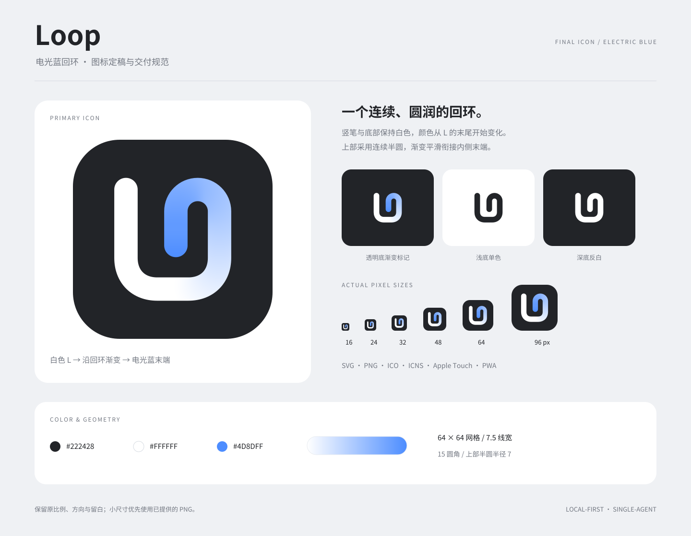

# Loop icon delivery

The approved Loop icon: a white L returns through a circular upper arch into an electric-blue inner tip on a charcoal tile. This is the single retained design. Monochrome and platform assets are adaptations of the same mark.

The icon artwork is excluded from the repository's MIT license and reserved under the [brand asset policy](BRAND-ASSETS.md). Delivery formats and technical examples do not grant permission to adopt it as another product's identity. The guide fonts remain open-source under SIL OFL 1.1.

## Start here

- [Design guidelines PDF](docs/Loop-Icon-Guidelines.pdf): four pages covering geometry, color, spacing, backgrounds and delivery.
- [Editable primary SVG](svg/loop-icon.svg): the approved master, with no font dependencies.
- [1024px PNG](png/loop-icon-1024.png) / [2048px PNG](png/loop-icon-2048.png): ready-to-use raster exports.
- [Usage and technical specifications](docs/usage.md).
- [Editable presentation board](docs/brand-board.svg): keep its relative links to the SVG and PNG folders.
- [Delivery verification](docs/verification.md).
- [Guide font source and license](fonts/README.md): bundled open-source fonts under SIL OFL 1.1.
- [File checksums](SHA256SUMS.txt): integrity hashes for the package contents.

## Assets

| Folder | Contents |
| --- | --- |
| `svg/` | Primary icon, transparent gradient mark, dark/white/currentColor marks, square platform source and padded macOS source |
| `png/` | 15 primary sizes: 16, 20, 24, 32, 40, 48, 64, 96, 128, 180, 192, 256, 512, 1024, 2048px; 1024px transparent/monochrome/square exports |
| `web/` | SVG/PNG/ICO favicon, Safari mask, Apple touch icon, 192/512px standard and maskable icons, manifest template |
| `native/` | [Loop.icns](native/Loop.icns) and a 10-file macOS iconset with standard and 2x representations |
| `docs/` | Design board, PDF guide, usage notes and verification scope |
| `fonts/` | Regular and bold guide-font subsets, source attribution and SIL OFL 1.1 license |

The application Dark theme uses the [white-tile SVG adaptation](svg/loop-icon-light.svg) and [256px PNG](png/loop-icon-light-256.png): a white tile with a charcoal-to-blue mark. Light retains the approved primary artwork; System follows the browser color scheme. These theme adaptations preserve the same geometry.

The primary SVG and 1024px PNG preserve the approved artwork exactly. The master uses masks and a blurred color field inside a crisp vector outline; raster exports are the appearance-preserving fallback. Single-color marks have no filters or masks.

The application uses this design in the sidebar, welcome screen, browser favicons and Safari icons. Runtime copies live in `src/web-ui/frontend/assets/`; the design masters remain here. A copy of this directory is provided in the adjacent `Loop-Icon-Delivery.zip`.
