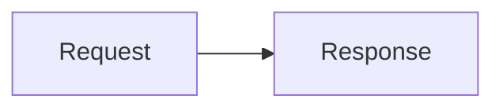

# Message Rendering

The timeline displays completed history and the current streaming draft. Drafts replace content at a message position; each text delta does not become a separate history entry.

User messages use compact spacing before the reply, reasoning section or Looping indicator. The timestamp and copy controls keep their reserved space, so revealing them does not shift the conversation.

## Supported Content

| Content | Behavior |
| --- | --- |
| User messages | Text and attachments, with a timestamp and copy icon revealed below on hover |
| Assistant text | Markdown, syntax highlighting, tables, KaTeX math, and Mermaid diagrams |
| Thinking | Expandable blocks containing only thinking returned by the model |
| Tool calls | Direct tool rows with individual status icons; expand a row to inspect parameters and results |
| Failed messages | Display errorMessage after streaming ends; errors remain visible when reopening history |

Tool calls and results merge by toolCallId instead of creating duplicate cards. A standalone result without a corresponding assistant call can still be displayed. Tools show actual execution state and final output, with no invented progress or interactive terminal.

## Tool Groups and Action Updates

Each user turn has one execution section, rendered by RunActivityCard and ExecutionGroup. Intermediate assistant updates associated with tool calls, thinking blocks, and tool batches appear in order along a shared vertical timeline. The latest assistant message's ordinary text streams immediately in the separate reply area when it has no tool calls, toolUse stop reason or explicit commentary phase. It never waits for session settlement or enters the height-limited reasoning scroll area merely because generation is still active. Thinking remains in reasoning. A text-only response needs no temporary reasoning section, and an answer keeps its DOM position through completion and reconnect. See [default prompt instructions](../../../coding-agent/docs/context-files.md).

The section header shows elapsed work time and a failure count. While running it updates every second, including when collapsed, for example **Working for 1m 2s**. After execution it freezes at **Worked for 28m 20s**; errors and cancellation retain their status. Chinese labels and seconds/minutes/hours are localized. Timing comes from the server's per-prompt metadata and survives reconnection, refresh and reopening saved history. It includes model preflight and model/tool work, excluding history saves and asynchronous title work. Old history without timing retains its status label; unknown outcomes use Execution details. Missing durations are never inferred from message timestamps.

Assistant replies display without an avatar or reserved icon column, both while streaming and after completion. The execution section and Looping indicator share the same left edge as the reply text on desktop and narrow screens. The nested execution-group heading uses up to 90 characters from the user request, excluding attachment bodies, or a generic label when no text is available. Active turns start with expanded execution sections and retain their current expansion state when generation completes, fails or is cancelled. Only manual toggling changes that state while the section remains mounted. Completed turns loaded from history start collapsed, showing only the duration/status header. Nested execution groups start expanded when the section is revealed; individual tool parameter/result details start collapsed. Expansion choices persist through subsequent tool batches, timer updates, completion and reconnection.

The execution-group icon follows reasoning and tool activity independently of the whole response. It stops spinning as soon as Pi AI reports thinking_end with no pending tools, or starts streaming ordinary text, without treating that text as a confirmed final answer. Native commentary metadata, further thinking or tool calls restore its running state. SSE snapshots retain the current draft phase across reconnection. The elapsed-work timer and Looping indicator still cover the complete response.

Consecutive tool calls within one assistant message form a batch. Text, thinking, and message boundaries separate batches without reordering content. Sections are projected from existing history and drafts without changing stored messages; timing arrives through the existing SSE envelope. A live message's stop reason is provisional: neither thinking_end, text_start nor message_end alone finalizes the whole turn. Without explicit phase metadata, text before a future call cannot be identified as a tool update yet. It initially appears in the reply area and moves into reasoning if that message later receives a tool call or a subsequent message makes it intermediate. This tradeoff keeps long replies readable during generation without markers, buffering, text heuristics or extra model requests. Explicit commentary starts inside reasoning. Intermediate messages remain keyed by message position and tool rows by call ID, preserving expanded tool details across streaming, results, settlement and reconnect.

The default prompt does not request tool descriptions or before/after narration. Tool names, file paths, commands and execution icons supply routine action and status information.

Native version-1 textSignature commentary metadata routes explicitly labeled updates into reasoning even before a call arrives; final-answer metadata uses the reply area unless the message belongs to a tool batch or an earlier intermediate response. Message text has no display-marker protocol: prefixes are neither parsed for phase nor buffered, stripped or trimmed. Existing marker text remains ordinary content, subject to normal Markdown rendering, and is included literally when copied. Raw events and stored history remain unchanged. Failed or cancelled last responses retain their partial text, stop reason and error when provided; errors with no text remain visible and a tool-only turn does not invent a final answer.

When a group has no non-empty text since the previous group in that message, the UI summarizes its observed actions in the interface language. A single action type includes the number of calls, such as Read 3 files or Run 2 commands. Mixed batches combine distinct actions in first-appearance order, such as Read files and Run commands; repeated action types are not repeated in the heading. Unknown tools use their names, with a generic label only while a name is unavailable. Counts describe calls, not distinct paths or successful results. Thinking alone is not an action update. These headings update as calls arrive, without remounting tool rows, inferring purpose from commands or requesting a model. They are neither saved into history nor included in assistant-message copying.

Each tool row starts with a muted category icon: an open book for read, a file with a plus for write, a pencil for edit, a terminal for bash, and a generic grid for other tools. Categories follow the tool name rather than interpreting shell commands; the separate status icon stays on the right. Icons are decorative because the adjacent text names the action. Each tool appears directly as an action and its actual argument, such as **Read src/app.ts** or **Bash · bun test**, followed by its status icon, with no intermediate call-count accordion. Read/write/edit rows use the path parameter. Bash rows show the actual command as **Bash · bun test** and never read a per-call description for the label. Legacy description arguments remain visible only in raw expanded parameters; stored history is not rewritten. Group action summaries come entirely from the frontend. Bash labels stay constant across execution states; the separate icon reports actual status. Other action labels follow the interface language and execution state; waiting or failed calls never use a success verb. Missing or incomplete arguments use a generic file/command label until a string value arrives; unknown tools retain their name. Long paths and commands stay on one line with an ellipsis, a full-text hover title and the unchanged parameters disclosure. These labels derive from existing streamed arguments and history without another model call. Tool batches use compact spacing between action updates and tool rows, with 5px vertical row padding and 6px group margins. Execution steps have a 6px gap, keeping the next action heading close to the final tool row of the preceding batch. They retain a shared left vertical line inset by 5px at both ends and indented rows, with tighter indentation on narrow screens; action updates stay outside that indentation. Tool rows appear as soon as tool-call generation arrives, before execution finishes. The icon to the right of the name spins from tool_execution_start until tool_execution_end, becomes a green check on success or a red cross on failure; queued calls retain a neutral waiting icon. Tool execution starts are synchronously committed to React, so even start/end events delivered in the same browser task initialize each row's running indication. For a live tool that succeeds in under 200ms, its icon completes a minimum 200ms running indication before showing the check, preventing start/end events received in one paint interval from hiding all activity. This local visual transition does not delay results, subsequent tools, final answers, stored status or the accessible status label. Errors and cancellation update immediately; completed history never replays the spinner. Hidden pages and reduced-motion preferences skip the hold, and each tool has its own timer that is cleared on unmount. Failure counts remain visible in the execution-section header even while other calls run. Cancellation retains the existing error results for skipped or cancelled calls rather than inventing successful completion. Expand a tool row to inspect its parameters and result. Tool results have no copy button. Parameters and results use equal-height adjacent panels on desktop, capped at 220px with independent scrolling, and stack on narrow screens.

Tool batches use the first call ID for stable identity and each tool row uses its own call ID; execution sections use session and turn positions. Streaming arguments, added calls, completion, and reconnect snapshots preserve open disclosures while the timeline stays mounted. Reopening a session collapses completed execution sections again, while a still-running turn starts expanded. Expanding a historical section reveals its execution group and tool rows; individual tool details start collapsed again. Different user requests and sessions never share a section. Existing history uses the same grouping without migration; standalone results remain inspectable within the execution section.

## Markdown and Copying

marked and KaTeX convert Markdown, then DOMPurify sanitizes it. Interactive elements such as form controls are removed from model content. Links retain only HTTP(S) targets and use noopener/noreferrer when opening a new window. highlight.js highlights code blocks with recognized languages.

User messages and completed assistant replies reveal a bottom row with the message time and an icon-only copy button on hover or keyboard focus. The row stays visible on touch devices and reserves its space to avoid shifting the conversation when revealed. Times use the interface language and local time zone; hovering over a time shows the full date and time. Attachment-only messages show the time without an empty copy action.

Code-block buttons copy the original code text. The complete assistant message's copy button includes text only, excluding thinking and tool arguments. Message copy buttons use localized **Copy message** and **Copy response** tooltips and accessible labels for user messages and assistant replies, respectively. They show a check on success or an error icon on failure, with localized tooltips and screen-reader feedback. The UI is not a full image, audio, or attachment viewer.

### Mermaid Diagrams

Assistant text renders fenced `mermaid` code blocks as diagrams, including restored history and intermediate assistant updates. For example:

Mermaid initializes on demand in the browser from the bundled dependency; no model call or remote rendering service is used. Diagrams follow Light, Dark and System appearance, including live system-theme changes. Each preview is a borderless, keyboard-focusable scroll region with no view toggle or source disclosure. Hover over the diagram or focus within it to reveal a top-right copy icon; touch devices keep it visible. The icon button has a transparent background, including on hover, so it blends into the surrounding preview in every theme. Its localized **Copy Mermaid source** tooltip and accessible label identify the action. Clicking it copies only that block's original Mermaid text, preserving whitespace without Markdown fences or generated SVG. After the clipboard confirms success, that button changes to a visible checkmark with a localized **Copied** label for three seconds, then restores the copy icon. Repeated successful copies restart the timer, and each diagram has independent feedback. Failed copies retain the copy icon with localized failure feedback instead of a success check. The button announces the result to screen readers, and the preview stays visible. Replacing the diagram or unmounting the message clears its timer and ignores late clipboard results. **Copy response** still copies the original Markdown, not generated SVG. Ordinary code blocks, user text, thinking and tool output keep their existing behavior.

During streaming, rendering waits for a 200ms pause in text updates. Source stays readable while loading or rendering, and unchanged successful diagrams are reused within the mounted message. Completing a response triggers rendering without that delay. Stale results are ignored after text changes or unmount; queued obsolete work is skipped. An already running Mermaid render cannot be interrupted, but its temporary DOM is removed when it settles. Syntax, size, layout or loading failures preserve the source and do not prevent other blocks from rendering. Completed responses show a localized fallback notice; partial streaming diagrams do not show error notices.

Rendering uses strict security, disables HTML labels and automatic document scanning, protects security/theme settings from diagram configuration, sanitizes generated SVG separately from Markdown, and does not bind diagram callbacks or retain clickable diagram links. Limits are 50,000 source characters and Mermaid's 500-edge limit; oversized or unsupported diagrams remain source. Rich HTML labels, custom icon packs, external diagram/layout plugins, zoom and export controls are not supported. Stored messages and backend/SDK contracts are unchanged.

## Scrolling and Lifecycle

Expanded reasoning items grow naturally up to the smaller of 420px or half the viewport height. Below that limit they have no vertical scrollbar; overflowing content scrolls within the items area, leaving the duration and execution-group heading outside it. Tool details remain expandable inside this area. Live updates follow the bottom while the reader stays near it; scrolling upward pauses following and scrolling back to the bottom resumes it. The region can be focused for keyboard scrolling. Completed history does not auto-follow.

Sending a message scrolls that user message to the top of the conversation viewport. Short turns reserve space below the content so the message can reach the top; replies fill that space as they grow. Streaming text, tool activity, completion and reconnect updates do not automatically scroll the conversation. Readers can scroll freely, and each new user message aligns at the top again. A compact circular down-arrow button appears when content extends below the viewport, with **Jump to latest** as its localized tooltip and accessible label. It scrolls to the latest content once, without enabling automatic following. Opening completed history starts at the latest content; opening a running conversation starts at its latest user message.

Complete snapshots come from the server. The browser maintains display state only and reloads history after refresh, rather than restoring a separate chat history from browser storage. See [streaming state](events.md).

## Source and Tests

- [MessageTimeline](../components/chat/MessageTimeline.tsx) / [tests](../components/chat/MessageTimeline.test.tsx).
- [AssistantMessage](../components/chat/AssistantMessage.tsx) / [tests](../components/chat/AssistantMessage.test.tsx).
- [RunActivityCard](../components/chat/RunActivityCard.tsx) / [tests](../components/chat/RunActivityCard.test.tsx).
- [RunDuration](../components/chat/RunDuration.tsx) / [timer tests](../components/chat/RunDuration.test.tsx).
- [ExecutionGroup](../components/chat/ExecutionGroup.tsx) renders the ordered steps.
- [Turn projection](../components/chat/timeline-turns.ts) / [tests](../components/chat/timeline-turns.test.ts).
- [ToolCard](../components/chat/ToolCard.tsx) / [tests](../components/chat/ToolCard.test.tsx).
- [ToolGroup](../components/chat/ToolGroup.tsx) / [tests](../components/chat/ToolGroup.test.tsx).
- [Content grouping](../components/chat/assistant-content.ts) / [tests](../components/chat/assistant-content.test.ts).
- [Markdown utilities](../lib/markdown.ts) / [security and formatting tests](../lib/markdown.test.ts).
- [MarkdownText](../components/chat/MarkdownText.tsx) / [rendering and copy tests](../components/chat/MarkdownText.test.tsx).
- [Mermaid renderer](../lib/mermaid.ts) / [SVG security and rendering tests](../lib/mermaid.test.ts).
- [Mermaid copy feedback](../lib/mermaid-copy.ts) / [timer and clipboard tests](../lib/mermaid-copy.test.ts).
- [useMermaid](../hooks/useMermaid.ts) / [streaming, theme and lifecycle tests](../hooks/useMermaid.test.tsx).
- [useAutoScroll](../hooks/useAutoScroll.ts) / [tests](../hooks/useAutoScroll.test.tsx).
- [Tool projection](../../shared/tool-projection.ts) / [tests](../../shared/tool-projection.test.ts).
